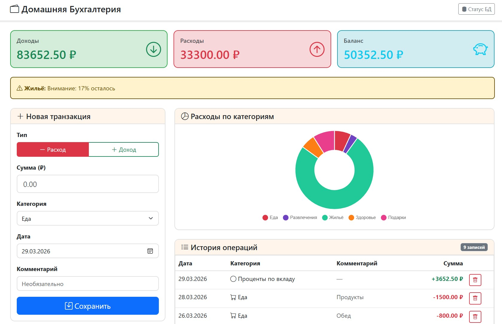
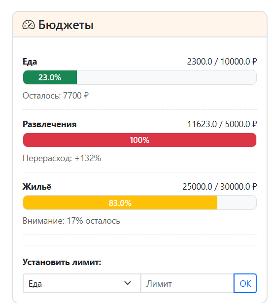
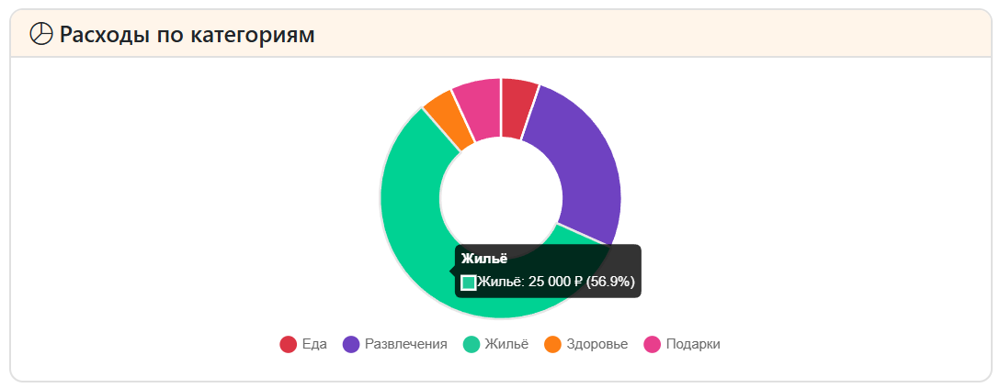

# Домашняя Бухгалтерия


Система учёта доходов и расходов с автоматическим контролем бюджетов

Учебный проект по дисциплине «Проектная деятельность»

---

## Описание

Веб-приложение для ведения домашней бухгалтерии с функциями автоматизированного контроля финансов. Система учитывает доходы и расходы, автоматически анализирует траты по категориям, предупреждает о превышении бюджетов и помогает принимать управленческие решения.

### Назначение системы

- Учёт личных доходов и расходов
- Контроль лимитов по категориям трат
- Визуализация финансовой статистики
- Автоматические уведомления о критических ситуациях

---

## Технологии

| Компонент | Технология | Версия |
|-----------|------------|--------|
| Язык программирования | Python | 3.9+ |
| Веб-фреймворк | Flask | 2.3.3 |
| База данных | PostgreSQL | 14+ |
| ORM | SQLAlchemy | 2.0+ |
| Драйвер БД | psycopg | 3.1+ |
| Frontend | HTML5, CSS3, JavaScript | — |
| UI-фреймворк | Bootstrap 5 | 5.3.0 |
| Иконки | Bootstrap Icons | 1.10.0 |
| Графики | Chart.js | 4.4.0 |

---


## Структура проекта

```markdown
home-budget/
├── app.py                  # Основной файл приложения (Flask)
├── init_db.py              # Скрипт инициализации БД с тестовыми данными
├── requirements.txt        # Зависимости Python
├── .env.example            # Шаблон переменных окружения
├── .gitignore              # Игнорируемые файлы
├── README.md               # Документация
├── templates/
│   └── dashboard.html      # Основной шаблон интерфейса
└── static/
    ├── css/
    │   └── style.css       # Пользовательские стили
    └── js/
        └── main.js         # Клиентская логика (фильтрация, графики)
```

---

## Структура базы данных

### Таблица `categories`

| Поле | Тип | Описание |
|------|-----|----------|
| id | INTEGER | Первичный ключ |
| name | VARCHAR(50) | Название категории |
| type | VARCHAR(10) | Тип: income или expense |
| icon | VARCHAR(50) | Иконка Bootstrap |

### Таблица `transactions`

| Поле | Тип | Описание |
|------|-----|----------|
| id | INTEGER | Первичный ключ |
| amount | DECIMAL(10,2) | Сумма транзакции |
| category_id | INTEGER | Внешний ключ → categories |
| type | VARCHAR(10) | Тип: income или expense |
| comment | TEXT | Комментарий |
| transaction_date | DATE | Дата операции |

### Таблица `budgets`

| Поле | Тип | Описание |
|------|-----|----------|
| id | INTEGER | Первичный ключ |
| category_id | INTEGER | Внешний ключ → categories |
| limit_amount | DECIMAL(10,2) | Лимит суммы |
| month | INTEGER | Месяц (1-12) |
| year | INTEGER | Год |

---

## Используемые библиотеки

```txt
Flask==2.3.3              # Веб-фреймворк
Flask-SQLAlchemy==3.0.5   # ORM для работы с БД
psycopg==3.1.12           # Драйвер PostgreSQL
python-dotenv==1.0.0      # Загрузка переменных окружения
Werkzeug==2.3.7           # Утилиты для Flask
```

---
## Особенности реализации АСУ

### 1. Структура управления

| Компонент АСУ | Реализация в проекте |
|---------------|---------------------|
| **Объект управления** | Личный бюджет пользователя |
| **Измерительная подсистема** | PostgreSQL + SQLAlchemy (хранение и агрегация транзакций) |
| **Управляющая подсистема** | Flask-маршруты: расчёт остатков, сравнение с лимитами |
| **Исполнительное устройство** | Веб-интерфейс (прогресс-бары, уведомления, графики) |
| **Обратная связь** | Цветовая индикация, flash-сообщения, блокировка действий |

---

### 2. Реализованные функции

| Функция | Алгоритм | Реакция системы |
|---------|----------|-----------------|
| **Контроль бюджета** | Сравнение spent + amount с limit | Flash-уведомление |
| **Раннее предупреждение (≥80%)** | `percent >= 80` | Жёлтый прогресс-бар |
| **Перерасход (≥100%)** | `percent >= 100` | Красный прогресс-бар |
| **Защита от удаления** | Проверка связанных транзакций | Блокировка + flash |
| **Прогнозирование** | Автоматический расчёт остатка | Отображение в карточке |

---

### 3. Ключевые алгоритмы

#### Контроль лимитов
При добавлении расхода система проверяет, не превысит ли сумма установленный бюджет:

```python
budget = Budget.query.filter_by(
    category_id=category_id,
    month=now.month,
    year=now.year
).first()

if budget and spent + amount > float(budget.limit_amount):
    flash(f'⚠️ Превышен лимит категории "{category.name}"!', 'warning')
```
#### Цветовая индикация
Состояние бюджета классифицируется по трем уровням:

```python
def get_budget_status(spent, limit):
    percent = (spent / limit) * 100
    if percent >= 100: return 'danger', percent, 'Перерасход'
    if percent >= 80: return 'warning', percent, 'Осталось мало'
    return 'success', percent, 'В норме'
```
### 4. Преимущества
- Автоматизация — пользователь не отслеживает остатки вручную
- Раннее предупреждение — сигнал при 80% лимита
- Защита от ошибок — блокировка удаления категорий с транзакциями
- Наглядность — цветовая индикация и графики

## Тестирование

### Проверка основного функционала

| Тест | Ожидаемый результат |
|------|---------------------|
| Добавление дохода | Баланс увеличивается |
| Добавление расхода | Баланс уменьшается, прогресс-бар обновляется, диаграмма обновляется |
| Превышение 80% бюджета | Жёлтый индикатор + предупреждение |
| Превышение 100% бюджета | Красный индикатор + уведомление |
| Удаление категории с транзакциями | Блокировка удаления |
| Удаление категории без транзакций | Успешное удаление |

---

## Скриншоты интерфейса

### Главная страница (Дашборд)



Карточки статистики, форма добавления транзакции, список операций

### Контроль бюджетов



Прогресс-бары с цветовой индикацией (зелёный/жёлтый/красный) в зависимости от приближения к расходу бюджета

### Диаграмма расходов



Круговая диаграмма распределения расходов по категориям

---

## Инструкция по запуску

### 0. Проверка требований
Перед началом убедитесь, что установлены:

- **Python 3.9 или выше:**

```bash
python --version
```
**Если Python не установлен:** Скачайте с https://www.python.org/downloads/
- **PostgreSQL 14 или выше:**
**Если PostgreSQL не установлен:** Скачайте с https://www.postgresql.org/download/
- pip (менеджер пакетов Python)

### 1. Клонирование репозитория
Откройте терминал (командную строку) и перейдите в папку, куда хотите скачать проект:

```bash
git clone https://github.com/lareinecatherine/home-budget.git
cd home-budget
```
Если нет Git: Скачайте архив проекта через кнопку "Code → Download ZIP" на GitHub и распакуйте в удобную папку.

### 2. Создание виртуального окружения
Виртуальное окружение изолирует библиотеки проекта от системных.

```bash
#Windows:
python -m venv venv
venv\Scripts\activate

#macOS/Linux:
python3 -m venv venv
source venv/bin/activate
```
Как проверить активацию: в начале строки терминала должно появиться (venv)

### 3. Установка зависимостей
Установите необходимые библиотеки

```bash
pip install -r requirements.txt
```
Проверка успешной установки:

```bash
pip list
```
В списке должны быть: Flask, Flask-SQLAlchemy, psycopg, python-dotenv

### 4. Настройка переменных окружения
Создайте файл .env на основе шаблона:

```bash
#Windows:
copy .env.example .env

#macOS/Linux:
cp .env.example .env
```

Откройте файл .env и заполните своими данными:

```env
DB_USER=postgres
DB_PASSWORD=твой_пароль_от_PostgreSQL
DB_NAME=budget_db
DB_HOST=localhost
DB_PORT=5432
SECRET_KEY=любой_секретный_ключ
```

### 5. Инициализация базы данных

```bash
python init_db.py
```

С помощью этого скрипта автоматически будет создана база данных, таблицы и тестовые данные для демонстрации.

**Проверка подключения**

```bash
python -c "from app import app, db; print('Подключение ОК')"
```

### 6. Запуск приложения
Запустите веб-сервер:

```bash
python app.py
```
Ожидаемый вывод:
 * Running on http://127.0.0.1:5000
 * Debug mode: on

Откройте в браузере: http://127.0.0.1:5000

---

## Автор

```txt
Студент группы [АСУбз-22-1] 
[Фамилия Иия]

Учебный проект 2026 года
```

---

## Лицензия

Учебный проект. Распространяется в образовательных целях.
